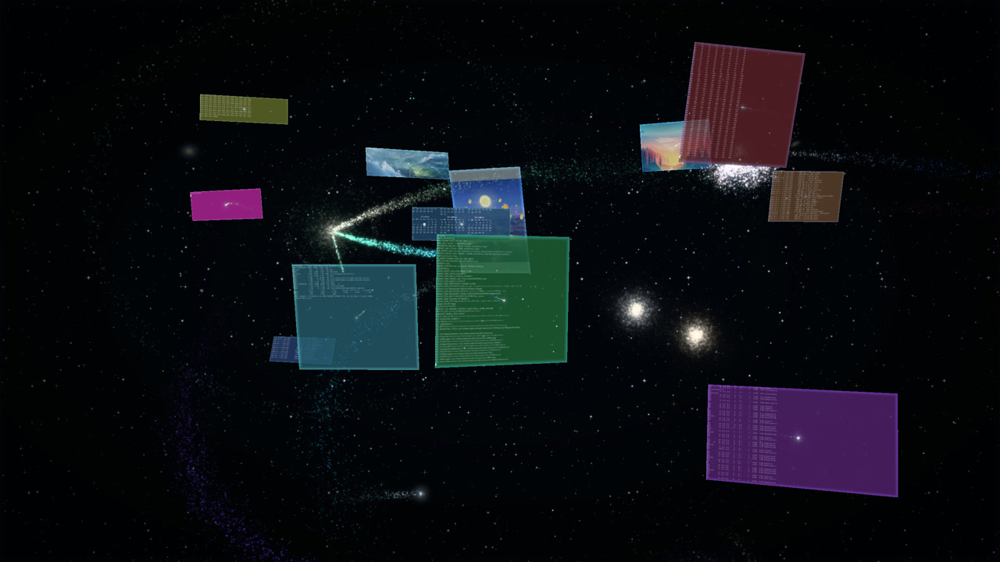
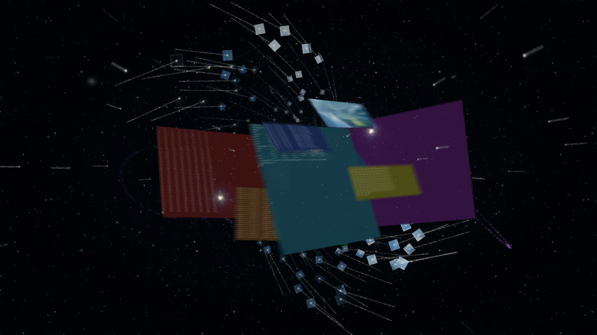
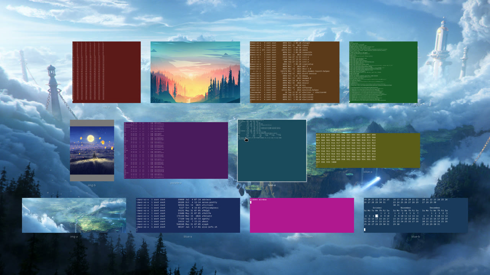

# dwm2

我在 Arch Linux 上自用的一套 dwm 桌面环境。窗口管理器、终端、合成器、锁屏、壁纸、状态栏和各种脚本都在这一个仓库里，`./setup.sh` 一条命令装好。

dwm 本体加了不少东西，最大的是 **Super+Z 3D 工作空间星系**：所有 tag 和窗口变成一个用 OpenGL 渲染的三维星系群，可以在里面浏览、搜索、切换窗口，也可以当屏保。



| 开场：桌面碎成星尘被吸进中心 | Super+A 窗口总览 |
|---|---|
|  |  |

<sub>截图来自 `dwm/tests/galaxy/` 的测试会话（Xvfb 软件渲染，测试窗口是彩色 xterm），真机效果更细腻。</sub>

## 特色

- **Super+Z 星系**：每个 tag 是一颗粒子恒星，每个窗口是绕它公转的截图卡片，所有 tag 沿三条开普勒椭圆轨道绕中央双星运行。三套开场随机轮换（桌面碎成星尘 / 穿过星门 / 大爆炸）；驻留时镜头自动巡游，打字可按标题过滤，点卡片或按 Enter 就无缝落到那个窗口；新开、关闭窗口和收到通知会变成天象（新星、流星、彗星）；`Esc` 坍缩回壁纸，`Super+Z` 飞回桌面。无操作 10 分钟自动以屏保方式进入。详见 [星系使用说明](docx/星系使用说明.md)。
- **Super+A 窗口总览**：窗口从原位置飞进网格，悬停浮起，可打字过滤，选中后无缝落位。和星系共用同一套渲染。
- **Super+Shift+R 原地重启**：自动编译安装 dwm 并原地重启，窗口和 tag 都保留；编译失败时弹通知，旧的 dwm 不受影响。
- **窗口管理**：彩虹色的 tag 下划线，全局窗口用图钉徽章标出，``Super+` `` 在最近两个 tag 间切换，`Super+=` 平铺层和浮动层交替置顶，焦点留在当前层。见 [dwm 使用说明](docx/dwm使用说明.md)。
- **壁纸**：静态壁纸每 5 分钟随机轮换，也能用动态壁纸（xwinwrap + mpv 播放视频，低分辨率视频用 Anime4K 放大）；切换时用 GPU 播放转场动画（`bin/transition.py`，着色器在 `config/transitions/`）。
- **Super+P 菜单**：动态 / 静态壁纸、省电模式（静态壁纸 + 60Hz + CPU 节能，拔电自动打开）、护眼、勿扰、暂停自动锁屏；接外接屏时多出显示器布局、分辨率和缩放，插拔自动套用上次的布局（`bin/monitor.sh`）。
- **远程桌面**：Sunshine + Moonlight，Tailscale 提供固定 IP，远程时 Alt 当作 Super 用；x11vnc 备用。见 [远程桌面使用说明](docx/远程桌面使用说明.md)。
- **其余**：betterlockscreen + i3lock-color 锁屏（输入时显示圆点）、flameshot 截图、dunst 通知、熄屏前调暗、低电量提醒、`Super+/` 快捷键速查、`Super+Shift+Esc` 电源菜单。

## 目录结构

```
config/   所有配置 (只改这里)
  dwm.h  st.h  tabbed.h      编译时使用的 config.h (星系参数在 dwm.h 末尾「Super+Z 星系」一节)
  picom.conf  dunst.conf     由 bin/autostart.sh 加载
  ranger/                    终端文件管理器, ~/.config/ranger 软链接到这里
  sunshine.conf              远程桌面串流, ~/.config/sunshine/sunshine.conf 软链接到这里
  betterlockscreenrc         锁屏主题, ~/.config/betterlockscreen/betterlockscreenrc 软链接到这里
  rofi/                      rofi 主题与配色, ~/.config/rofi 软链接到这里
  transitions/               壁纸切换的 GPU 转场着色器 (gl-transitions)
  anime4k/                   动态壁纸放大用的 Anime4K 着色器
  xinitrc                    环境变量与会话服务, ~/.xinitrc 软链接到这里
  Xresources                 Xft.dpi 等, ~/.Xresources 软链接到这里
bin/      dwm 调用的脚本 (快捷键、状态栏、自启动)
  autostart.sh               dwm 启动时执行, 所有开机启动项都在这里
  statusbar/                 状态栏
  reload.sh                  Super+Shift+R: 编译安装 dwm 并原地重启
  galaxysaver.py             星系屏保 (无操作 10 分钟进入星系)
  galaxynote.sh              把 dunst 通知转成星系里的彗星
  livewall.sh transition.py  动态 / 静态壁纸, 壁纸切换转场
  monitor.sh                 显示器布局、分辨率、缩放, 插拔检测
  powersave.sh nightlight.sh 省电模式, 护眼暖色 (Super+P 菜单)
  power.sh keys.sh           电源菜单 (Super+Shift+Esc), 快捷键速查 (Super+/)
  sunshine.sh vnc.sh         远程桌面
  batalert.sh dimscreen.sh   低电量提醒, 锁屏前调暗提醒
  blurlock.sh rofi.sh set_vol.sh dpms.sh translate.sh ...
dwm/                         dwm 源码, 直接修改, ./setup.sh dwm 编译安装
  galaxy*.c                  Super+Z 星系 (场景、镜头、OpenGL 渲染、交互)
  overview.c                 Super+A 窗口总览
  tests/galaxy/              星系的测试工具 (独立的 Xvfb 会话, 不影响当前桌面)
st/ tabbed/                  终端和标签容器源码, ./setup.sh st | tabbed
picom/                       上游 picom v13 加一个 _DWM_NOANIM 补丁, 见 picom/README.dwm2.md
i3lock-color/                锁屏用的 i3lock-color 源码, ./setup.sh i3lock
scripts/                     手动运行的工具脚本 (music_covers.py 补专辑封面)
docx/                        使用说明, 入口 docx/README.md
wallpaper/                   壁纸, 私有仓库 dwm2-wallpaper 的 Git 子模块 (Git LFS); ~/Pictures/wallpaper 软链接到这里
  static/                    静态图片 (按题材分子目录)
  live/                      动态壁纸 (mp4、Wallpaper Engine 场景)
setup.sh                     安装/编译入口
```

`$DWM` 指向本仓库根目录 (在 `config/xinitrc` 中导出)。

## 安装与使用

需要 Arch Linux 和 yay (依赖用 pacman / yay 安装)。

```sh
git clone --recursive <本仓库> ~/projs/dwm2   # wallpaper/ 是私有子模块, 需要 dwm2-wallpaper 的访问权限和 git-lfs; 没有权限时跳过, 目录留空
cd ~/projs/dwm2 && ./setup.sh          # 依赖 + 链接 + 编译全部

./setup.sh deps | link                 # 只装依赖 / 只建软链接
./setup.sh st | tabbed | picom | i3lock   # 改了对应源码或配置后单独编译安装
```

改了 `config/dwm.h` 或 `dwm/` 源码后按 `Super + Shift + R` 生效 (自动编译安装并原地重启)。脚本和 picom / dunst 配置修改后无需编译。

## 文档

使用说明都在 [docx/](docx/README.md)：

| 文档 | 内容 |
|---|---|
| [dwm使用说明](docx/dwm使用说明.md) | 快捷键、鼠标、tag、状态栏、窗口规则、修改配置 |
| [星系使用说明](docx/星系使用说明.md) | Super+Z 星系的操作、天象、屏保、减弱动效、参数 |
| [终端使用说明](docx/终端使用说明.md) | st + tabbed |
| [picom使用说明](docx/picom使用说明.md) | 透明、圆角、模糊、动画 |
| [rofi使用说明](docx/rofi使用说明.md) | 启动器、切换窗口、Super+P 菜单 |
| [通知使用说明](docx/通知使用说明.md) | dunst |
| [锁屏与截图使用说明](docx/锁屏与截图使用说明.md) | 锁屏、自动锁屏、flameshot |
| [远程桌面使用说明](docx/远程桌面使用说明.md) | Sunshine + Moonlight, x11vnc |

## 致谢

- dwm / st / tabbed 最初取自 [yaocccc](https://github.com/yaocccc) 的版本 (再往上是 [suckless](https://suckless.org/))，之后在本仓库里改动了很多
- [picom](https://github.com/yshui/picom) v13 (yshui)
- rofi 主题来自 [adi1090x/rofi](https://github.com/adi1090x/rofi) (type-1 / style-5)
- [i3lock-color](https://github.com/Raymo111/i3lock-color)、[betterlockscreen](https://github.com/betterlockscreen/betterlockscreen)
- 壁纸转场着色器来自 [gl-transitions](https://github.com/gl-transitions/gl-transitions)，动态壁纸放大用 [Anime4K](https://github.com/bloc97/Anime4K)

各部分沿用原有的许可证，见各目录下的 LICENSE 文件。
